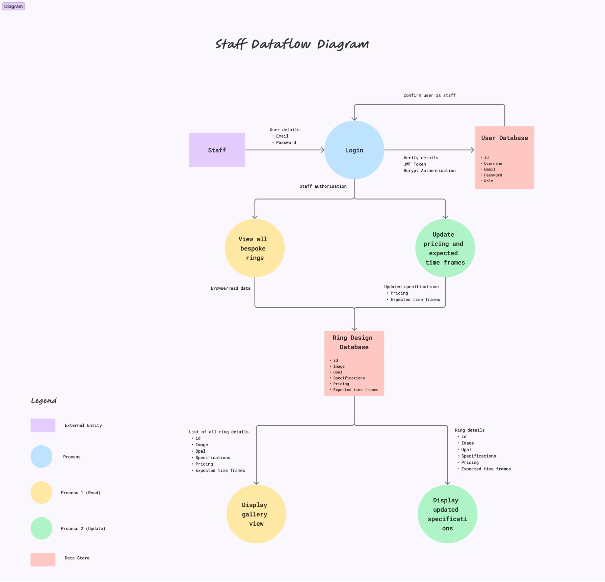
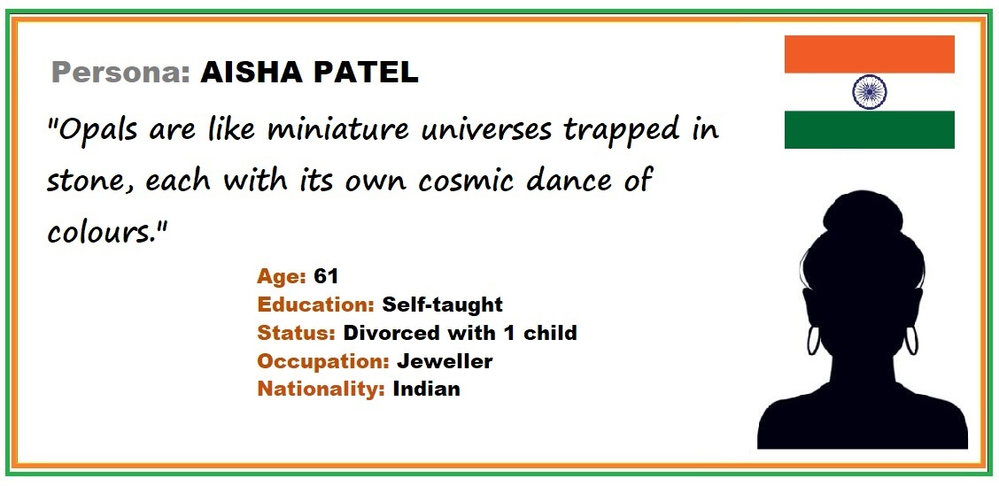
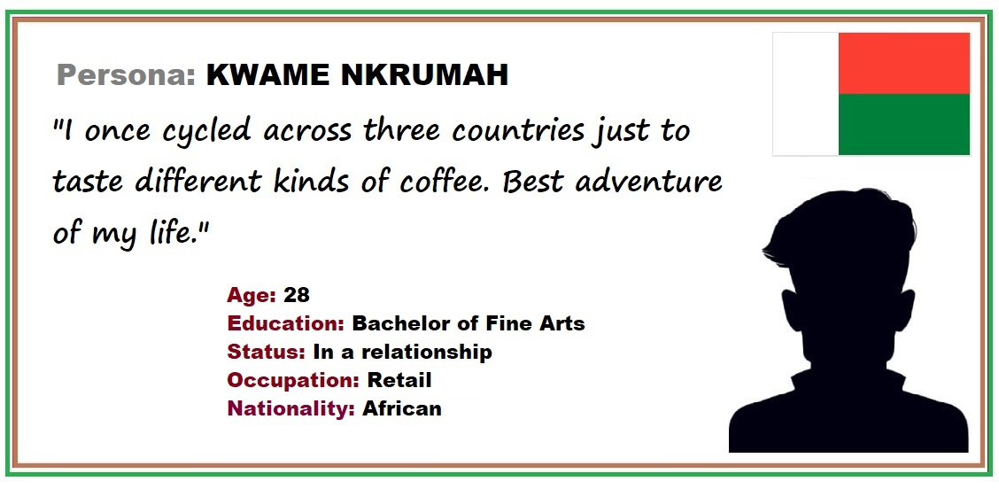
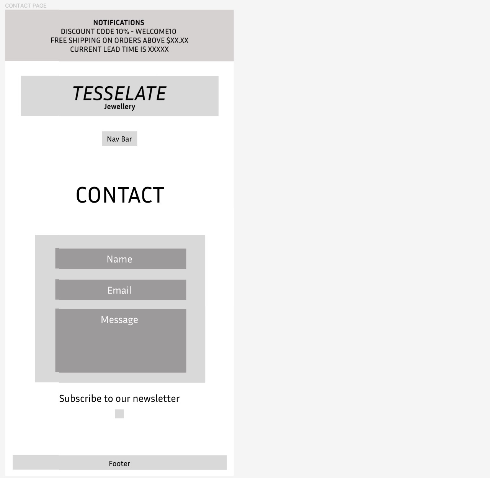

# Jeevan Ng T3A1

## Tesselate Bespoke Jewellery - MERN stack app 

## Purpose 

This web application aims to give our client, a well-established jeweller of over 30 years, a strong online presence in line with the changing trends in the jewellery industry. Addressing the absence of a digital footprint for our client's business, the app is designed to create a comprehensive platform showcasing the timeless craftsmanship and distinctive offerings of our client's custom jewellery.

In a competitive digital market, our client, having relied on word-of-mouth referrals, now wants to expand beyond brick-and-mortar. This move is a strategic decision to embrace modernity while preserving the craftsmanship that defines our client's legacy.

The web app serves as a crucial tool to reach a broader audience, offering a virtual showroom for potential customers to explore custom opal rings, a focus of the initial phase. Users can delve into the details of each opal and get a quote based on their specifications. This will foster a more engaging and interactive experience.

By going digital, our client aims to build their brand online and enhance communication with a diverse range of clientele. This venture reflects our commitment to using technology to boost brand visibility, establish a lasting online presence, and position our client in the contemporary jewellery landscape.

Through a blend of tradition and innovation, this web application represents a significant step in ensuring our client's creations captivate a wider global audience.

## Functionality/Features 

This application functions as a custom quote generator (e-commerce) platform and gallery specialising in showcasing bespoke jewellery (opal rings). Diverse sets of functions/features tailored to distinct user categories will be incorporated systematically through iterative development cycles, managed and tracked using the project management tool, *Trello*. 

**Client**
- When authorised as an administrator, the client will have the ability to: 
    - Full Create, Read, Update, Delete (CRUD) operations in opals, stone settings, base metals, pricing and quotes list. 
    - Authority to update any information within the system. 
    - Permission to delete user profiles as required. 

**Staff**
- When authorised as a staff member, staff will have the ability to: 
    - Update pricing information on opals
    - Update pricing information on stone setting and base metals. 
    - Updating expected time frames from start to finish. 

**Customer**
- Option to create a personalised login account
- Mandatory login to retrieve quote for custom opal ring
- Capability to deactivate their account 
- View list of opal stones available for custom designs
- Ability to choose stone setting and base metal for bespoke ring.
- Retrieve quote based on all custom preferences.

**Other**
- Site navigation 
- Quote calculator 

**Nice to Haves**
- Ratings/reviews
- FAQ
- Testimonials
- Search functionality
- cart checkout and payment options 

## Tech Stack

**Front-end**
- HTML5
- CSS 
- React.js 
- Javascript

**Back-end**
- Node.js
- Express.js

**Database**
- MongoDB
- Mongoose

**Deployment**
- Netlify (front-end)
- Heroku (back-end)

**Testing**
- Jest

**Project Management Tools**
- Trello

**Utilities**
- Figma
- Draw.io
- Discord

**Source Control**
- Git
- Github
- VS Code

## Target Audience

The target audience for the web application would include:

1. Prospective Customers
    - Individuals who have a keen interest in jewellery, especially custom and bespoke designs.
    - Collectors looking for unique and personalised pieces.
    - Individuals seeking custom made jewellery for special occasions like birthdays, engagements or other special occasions. 
2. Global Audience
    - Individuals beyond the client's traditional base. 
    - Consumers who prefer to purchase jewellery online. 

## Application Architecture Diagram

## For all diagrams below. Click image to open in new tab AND save image to local machine for higher resolution. 

## Dataflow Diagram

## User

## Admin

## Staff

## Initial Research (User Stories)

## Persona #1

## User Story

1. As the business owner, I want to efficiently manage and update the inventory of opals, base metals, and settings available for custom opal rings, ensuring that our customers have a diverse and up-to-date selection to choose from.

2. As the business owner, I would like to receive an email whenever a user requests a quote, containing all the specifications of the bespoke ring they are interested in.

## Persona #2

## User Story

1. As a staff member, I want a feature that allows me to update the pricing of opals, metals, and settings based on market trends, costs and instructions from my boss. 

2. As a staff member, I want to be able to update the expected time frames that a bespoke ring will take to make from start to finish, based off recommendations from my boss. 

## Persona #3

## User Story

1. As a customer, I want to browse a diverse selection of opals to choose one that resonates with my partner and receive a quote on pricing. 

2. As a customer, I would like to receive a confirmation email with the details of my custom ring configuration after requesting a quote.

## Persona #4

## User Story

1. As a customer, I want the flexibility to select the base metal for my ring, choosing between gold and silver, and specify the carat to align with my preferences and budget. 

2. As a customer, I want the pricing of my custom opal ring to be transparent and determined based on the opal chosen, selected base metal, and preferred setting, ensuring I can make an informed decision. 

## Persona #5

## User Story

1. As a customer, I would like to have a user-friendly interface that guides me step-by-step through the process of creating a custom opal ring, ensuring a seamless and enjoyable experience.

2. As a customer, I want to explore various settings such as bezel or claw, allowing me to tailor the aesthetic of my custom opal ring to match my style.

3. As a customer, I expect the business to provide accurate and timely quotes reflecting the specifications I choose for my custom opal ring, facilitating a seamless process.

4. As a customer, I want to know how long the quote is valid for, and whether I will be contacted by the business regarding my quote. 

## After second consultation with business owner and staff

1. As the business owner, I want a dashboard that displays customer requests for custom opal rings. This feature will help me track popular choices, enabling strategic decisions on stock levels and marketing efforts. It also assists in understanding customer preferences and adjusting offerings accordingly.

2. As a business owner, I need the ability to easily update the list of available opals, ensuring that customers have access to the latest and most diverse selection.

3. As a staff member, I want an intuitive interface that a tech-illiterate person can use easily for updating pricing on different opals and metal options, ensuring accurate and consistent information is presented to customers.

## Follow-up Market Research

1. As a customer, I desire the flexibility to purchase the opal stone separately or receive a quote for the opal alone, without the need for additional settings or customisation.

2. As a user, I expect responsive customer support through live chat or email to address any queries regarding opal specifications, pricing, or the ordering process.

3. As a customer, I want comprehensive information about each opal, including where it was sourced from, clarity, size, carat, colour and dimensions, to make an informed decision. 

4. As a customer, I want to receive the quote in the currency of my choice (USD, Euro, AUD etc.), allowing me to a better informed decision. 

## Wireframes

Link to wireframes: https://www.figma.com/file/6r00G1LGA2Smhjsb9JIpPu/tesselate_jewellery_wireframes?type=design&node-id=0%3A1&mode=design&t=xk1Z8a83WoEISc8b-1

## Mobile

- Minimum width of 360px 
- Use of hamburger menu for mobile view
- Focus on images and large text for accessibility

### Home page and Gallery Page

### Browse and Quote Page

### About us and FAQ Page

### Contact Page

## Project Management Tracker 

## Screenshots (Trello)

Link to trello board: 

https://trello.com/b/40QQzH27/tesselate-bespoke-jewellery

