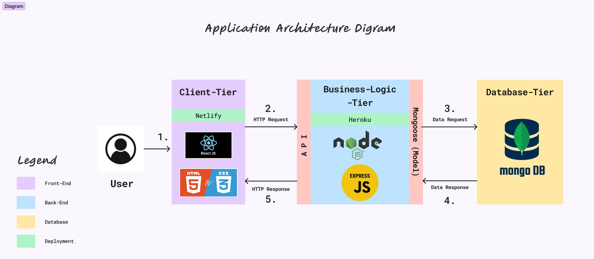

# Jeevan Ng T3A1

## Tesselate Bespoke Jewellery - MERN stack app 

## Purpose 

This web application aims to give our client, a well-established jeweller of over 30 years, a strong online presence in line with the changing trends in the jewellery industry. Addressing the absence of a digital footprint for our client's business, the app is designed to create a comprehensive platform showcasing the timeless craftsmanship and distinctive offerings of our client's custom jewellery.

In a competitive digital market, our client, having relied on word-of-mouth referrals, now wants to expand beyond brick-and-mortar. This move is a strategic decision to embrace modernity while preserving the craftsmanship that defines our client's legacy.

The web app serves as a crucial tool to reach a broader audience, offering a virtual showroom for potential customers to explore custom opal rings, a focus of the initial phase. Users can delve into the details of each opal and get a quote based on their specifications. This will foster a more engaging and interactive experience.

By going digital, our client aims to build their brand online and enhance communication with a diverse range of clientele. This venture reflects our commitment to using technology to boost brand visibility, establish a lasting online presence, and position our client in the contemporary jewellery landscape.

Through a blend of tradition and innovation, this web application represents a significant step in ensuring our client's creations captivate a wider global audience.

## Functionality/Features 

This application functions as a custom quote generator (e-commerce) platform and gallery specialising in showcasing bespoke jewellery (opal rings). Diverse sets of functions/features tailored to distinct user categories will be incorporated systematically through iterative development cycles, managed and tracked using the project management tool, *Trello*. 

**Client**
- When authorised as an administrator, the client will have the ability to: 
    - Full Create, Read, Update, Delete (CRUD) operations in opals, stone settings, base metals, pricing and quotes list. 
    - Authority to update any information within the system. 
    - Permission to delete user profiles as required. 

**Staff**
- When authorised as a staff member, staff will have the ability to: 
    - Update pricing information on opals
    - Update pricing information on stone setting and base metals. 
    - Updating expected time frames from start to finish. 

**Customer**
- Option to create a personalised login account
- Mandatory login to retrieve quote for custom opal ring
- Capability to deactivate their account 
- View list of opal stones available for custom designs
- Ability to choose stone setting and base metal for bespoke ring.
- Retrieve quote based on all custom preferences.

**Other**
- Site navigation 
- Quote calculator 

**Nice to Haves**
- Ratings/reviews
- FAQ
- Testimonials
- Search functionality
- cart checkout and payment options 

## Tech Stack

**Front-end**
- HTML5
- CSS 
- React.js 
- Javascript

**Back-end**
- Node.js
- Express.js

**Database**
- MongoDB
- Mongoose

**Deployment**
- Netlify (front-end)
- Heroku (back-end)

**Testing**
- Jest

**Project Management Tools**
- Trello

**Utilities**
- Figma
- Draw.io
- Discord

**Source Control**
- Git
- Github
- VS Code

## Target Audience

The target audience for the web application would include:

1. Prospective Customers
    - Individuals who have a keen interest in jewellery, especially custom and bespoke designs.
    - Collectors looking for unique and personalised pieces.
    - Individuals seeking custom made jewellery for special occasions like birthdays, engagements or other special occasions. 
2. Global Audience
    - Individuals beyond the client's traditional base. 
    - Consumers who prefer to purchase jewellery online. 

## Application Architecture Diagram

## For all diagrams below. Click image to open in new tab AND save image to local machine for higher resolution. 

## Dataflow Diagram

## User

## Admin

## Staff

## Screenshots (Trello)

Link to trello board: 

https://trello.com/b/40QQzH27/tesselate-bespoke-jewellery

